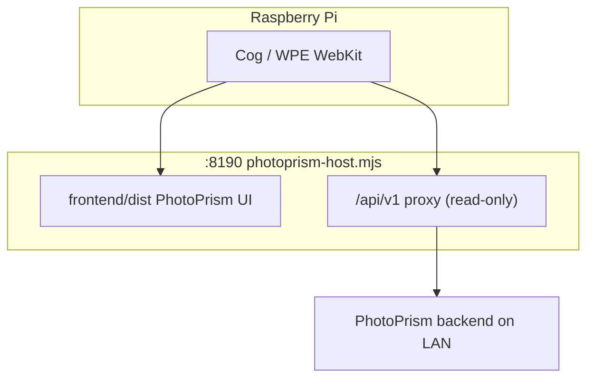

# PicoGallery V2

A digital photo frame for Raspberry Pi (especially **Pi Zero 2 W**) built on the
**PhotoPrism Vue UI**. A small Node host on port **8190** serves `frontend/dist`,
reverse-proxies read-only API traffic to a **PhotoPrism backend** on your LAN, and
auto-authenticates so the kiosk browser opens the normal photo library grid — no
fullscreen slideshow boot (`?kiosk` is not used by default).

```mermaid
graph TD
    subgraph Display
        Kiosk[Cog / WPE WebKit kiosk]
    end

    subgraph Host8190[Node host :8190]
        SPA[PhotoPrism Vue UI]
        Proxy[/api/v1 proxy]
        SPA --- Proxy
    end

    subgraph Backend
        PhotoPrism[PhotoPrism Go backend]
    end

    Kiosk -->|/library/photos| SPA
    Kiosk -->|thumbnails via API| Proxy
    Proxy -->|session + API| PhotoPrism
    Proxy --> PhotoPrism
```

## Layout

| Path | Role |
|------|------|
| frontend/ | PhotoPrism Vue SPA (build → `frontend/dist`) |
| scripts/photoprism-host.mjs | SPA static server + PhotoPrism API proxy |
| install.sh | Pi kiosk + systemd units for host and Cog |

## Quick start (local)

```bash
./run.sh setup            # pnpm install
# point the source at your PhotoPrism backend — see below
PICO_CONFIG=./config.local.toml ./run.sh dev   # server :8188 + Vite :5173
```

Open <http://localhost:5173> for the PhotoPrism UI during development.

Minimal config — photos come from a PhotoPrism backend over the network (there is
no local directory source; the frame never scans the device's own filesystem):

```toml
[http]
port = 8188

[[sources]]
name     = "photoprism"
url      = "http://photoprism.local:2342"
username = "admin"
password = "change-me"
order    = "newest"
```

Config is resolved from `$PICO_CONFIG`, then `~/.config/picogallery/config.toml`,
then `/etc/picogallery/config.toml`. Every key is overridable with
`PICO_<SECTION>_<KEY>` env vars (e.g. `PICO_HTTP_PORT=9000`). See
[`config.example.toml`](config.example.toml) and [docs/sources.md](docs/sources.md).

## Docker

```bash
docker compose -f docker/docker-compose.yml up --build
# PhotoPrism UI at http://localhost:8188, photos pulled from the bundled PhotoPrism service
```

## Raspberry Pi kiosk (Cog + Cage / WPE WebKit)

The appliance display surface is **Cog (WPE WebKit)** running under the **Cage**
Wayland kiosk compositor — no X11, no desktop. Cage opens DRM/KMS directly via
`seatd` and forces its single client (Cog) fullscreen.

> [!NOTE]
> **Slideshow Client by Default:** The installer is configured to launch the dedicated slideshow client on the HDMI output (port `8188`), connecting to your PhotoPrism backend over the network. For details on server and UI optimizations built for the Pi Zero 2 W, see [OPTIMIZATIONS.md](OPTIMIZATIONS.md).

### Quick Install (Pre-built Release)

Run these commands on the Pi to download and install the latest pre-compiled release in less than 10 seconds:

```bash
# 1. Create the persistent directory and navigate into it
sudo mkdir -p /opt/picogallery
sudo chown -R $USER:$USER /opt/picogallery
cd /opt/picogallery

# 2. Download and extract the latest release
curl -sSLO https://github.com/kethanva/pico-gallery-photoprism/releases/latest/download/picogallery-release.tar.gz
tar -xzf picogallery-release.tar.gz
rm picogallery-release.tar.gz

# 3. Run the installer
sudo ./install.sh --mode all --photoprism-url http://photoprism.local:2342 --photoprism-user admin --photoprism-pass changeme -y
```

> [!IMPORTANT]
> The release tarball must include a valid `frontend/dist` bundle (`assets.json`, `app.js`, `app.css`).
> The Pi appliance (especially 512 MB boards) cannot reliably run the webpack build on-device.
> If reinstall still shows a blank screen, run:
> `sudo ./scripts/pi-e2e-diagnose.sh /opt/picogallery`

---

`install.sh` is a **one-click, end-to-end provisioner**. It detects the
board + architecture, checks/fixes dependencies, installs packages, (optionally)
installs Node + builds the server, writes config + systemd units, and verifies
the result — idempotently. Three modes:

```bash
# Display only — the server runs on another host (works on any Pi, incl. Pi Zero):
sudo ./install.sh --mode kiosk --server-url http://<server-host>:8188

# Everything on this Pi (needs 64-bit / ARMv7 — Pi Zero 2 W, Pi 3/4/5)
# pointing to a PhotoPrism backend, with a nightly display blank:
sudo ./install.sh --mode all \
  --photoprism-url http://nas:2342 --photoprism-user admin --photoprism-pass secret \
  --blank-on 22:00 --blank-off 07:00
```

> The original **Pi Zero / Zero W is ARMv6**, which modern Node.js does not
> support — those boards are kiosk-only (`--mode kiosk`) and point at a server
> elsewhere. The installer detects this and tells you. `--mode auto` (the default)
> picks the right mode for the board.

What it sets up:

* **kiosk** — `cog` + `cage` + `seatd`, a `picokiosk` user, the launcher
  (`/usr/local/bin/picogallery-kiosk`, which waits for `/api/v1/health` before
  opening Cog), a systemd unit, a tight sudoers entry, and the KMS/`gpu_mem` boot
  settings Cage needs.
* **server** — Node 22 (NodeSource) (pre-built release packages all dependencies and compiled static assets, so `pnpm` is not required). Runs the slideshow server on port `8188` to connect to your backend and serve the slideshow client.
* **`pico-display-power`** + `pico-display-{on,off}.timer` when `--blank-on/--blank-off`
  are given — daily display power via `vcgencmd`, DSI backlight, or DRM DPMS.

Other flags: `--dry-run` (preview), `-y/--yes` (no prompts), `--verbose`,
`--uninstall`. Run `sudo ./install.sh --help` for the full list. Source
for the launcher/units/sudoers lives in [`kiosk/cog/`](kiosk/cog/); see
[docs/deployment.md](docs/deployment.md) for details.

### Mimic the kiosk on a dev machine

Cog+Cage are Linux/Wayland-only and can't run on macOS. To preview the UI as the Pi would show it, use the host browser:

```bash
./run.sh kiosk            # open the PhotoPrism UI in the default browser (or real Cog+Cage on a Pi)
./run.sh appliance        # host + kiosk browser together, end to end
```

See [docs/deployment.md](docs/deployment.md#keyboard--mouse-detection) for Pi keyboard/mouse troubleshooting.

## PhotoPrism UI on the Pi (end-to-end)

The appliance runs **Cog under Cage** fullscreen at the OS level, but the web app boots
to the **normal PhotoPrism photo library** (`/library/photos`) — not an auto-playing
fullscreen slideshow. Users browse the grid, open photos in the lightbox, and use
standard PhotoPrism navigation.



| Step | What happens |
|------|----------------|
| **Boot** | `picogallery-kiosk.service` waits for `/api/v1/ready`, then opens `FRAME_URL` (default `http://localhost:8190/library/photos`). |
| **Host** | `picogallery-photoprism.service` serves the built SPA and proxies PhotoPrism with an admin session from `config.toml`. |
| **UI** | PhotoPrism loads the library grid with full chrome (navigation, search, albums). No `?kiosk` / `?slideshow` auto-boot. |
| **Lightbox** | Click a photo to open PhotoSwipe; Escape or the close control returns to the grid. |

Build the UI before starting the host:

```bash
./run.sh build
./run.sh photoprism http://<photoprism-host>:2342
```

### Keyboard & mouse on the Pi

Input reaches the page through USB → udev seat0 → Cage → Cog (`--platform=wl`).
See [docs/deployment.md](docs/deployment.md#keyboard--mouse-detection) if keyboard or
mouse input is dead after install. In the lightbox, **F** toggles fullscreen and **Escape** closes back to the grid.

---

## CLI Reference

### `./run.sh` Commands

| Command | Description |
|---|---|
| `./run.sh setup` | Install all workspace dependencies using `pnpm`. |
| `./run.sh dev` | Start development servers (Vite client with HMR on `:5173`, Fastify API on `:8188`). |
| `./run.sh build` | Build all packages (`@pico/shared` → `@pico/server` → `@pico/client`) for production. |
| `./run.sh start [config]` | Build production client assets, then start Fastify server. Explicit config path optional. |
| `./run.sh clean` | Delete all built packages (`dist`) and `node_modules` folders. |
| `./run.sh typecheck` | Run typechecker (`tsc --noEmit`) across the monorepo. |
| `./run.sh kiosk [url]` | Open the PhotoPrism UI fullscreen (real Cog+Cage on Linux/Pi; default-browser mimic on macOS). |
| `./run.sh appliance [config]` | Mimic the whole appliance: build, start the host, then open the UI in the kiosk browser. |
| `./run.sh photoprism <url>` | Start the PhotoPrism Vue proxy host on `:8190` pointing to the specified backend URL. |

### `install.sh` (Pi end-to-end provisioner) Flags

Run on the device as root: `sudo ./install.sh [flags]`.

| Flag | Parameter | Description |
|---|---|---|
| `--mode` | `auto\|kiosk\|server\|all` | What to install. `auto` (default) picks by board/arch. |
| `--server-url` | `URL` | PhotoPrism UI URL the kiosk opens (required in `kiosk` mode). |
| `--source` | `photoprism\|webdav` | Server photo source (server modes; default `photoprism`). |
| `--photoprism-url/-user/-pass` | — | PhotoPrism connection (for `--source photoprism`). |
| `--webdav-url/-user/-pass` | — | WebDAV connection (for `--source webdav`). |
| `--blank-on` / `--blank-off` | `HH:MM` | Nightly display-blank window (both required together). |
| `-y, --yes` | (None) | Don't prompt; accept safe defaults. |
| `--dry-run` | (None) | Print actions without changing the system. |
| `--verbose` | (None) | Verbose output. |
| `--uninstall` | (None) | Remove **all** PicoGallery traces: services/timers (incl. legacy names), binaries, sudoers, seat udev rule, users + home caches, `/etc/picogallery`, `/var/cache/picogallery`, the install log, the build swap, reverted boot-config/USB backups, and local `node_modules`/`dist`. Delegates to `uninstall.sh`. |

---

## Configuration Reference (`config.toml`)

All keys support both `snake_case` and `camelCase`. Below is the complete configuration matrix:

### `[display]`

| Key | Type | Default | Description |
|---|---|---|---|
| `slide_duration_secs` | `number` | `10` | Seconds to show each photo. |
| `transition` | `string` | `"fade"` | Transition effect: `cut` \| `fade` \| `slide_left` \| `slide_right`. |
| `transition_ms` | `number` | `800` | Duration of the transition animation. |
| `fill_screen` | `boolean` | `false` | If true, crop/zoom image to cover display; if false, letterbox. |
| `letterbox_blur` | `boolean` | `true` | If true, blur the photo in the letterbox background instead of solid black. |
| `ken_burns` | `boolean` | `false` | Enable slow pan/zoom animation. |
| `show_osd` | `boolean` | `true` | Display information overlay (filename, metadata, date). |
| `show_clock` | `boolean` | `false` | Display local clock overlay. |
| `order` | `string` | `"shuffle"` | Sort mode: `shuffle` \| `chronological` \| `newest_first` \| `date_cluster`. |
| `on_this_day_boost` | `boolean` | `true` | Give photos taken on today's calendar date higher priority. |
| `max_image_mb` | `number` | `100` | Maximum source file size before the guard rejects it (`413`). |
| `max_megapixels` | `number` | `64` | Maximum source megapixels before the guard rejects it (`413`). |

### `[display.night]`

Adjusts display parameters when screen blanking is not active.

| Key | Type | Default | Description |
|---|---|---|---|
| `start` | `string` | `none` | Night schedule start time (`HH:MM`). |
| `end` | `string` | `none` | Night schedule end time (`HH:MM`). |
| `dim_percent` | `number` | `none` | Target brightness percentage (e.g. `25` for 25%). |
| `warmth` | `number` | `none` | Temperature warmth factor. |

### `[display.schedule]`

Hardware control schedules (toggled via systemd/cron hooks).

| Key | Type | Default | Description |
|---|---|---|---|
| `on` | `string` | `none` | Turn display on time (`HH:MM`). |
| `off` | `string` | `none` | Turn display off time (`HH:MM`). |

### `[cache]`

| Key | Type | Default | Description |
|---|---|---|---|
| `max_mb` | `number` | `256` | Disk resize cache budget limit. |
| `dir` | `string` | (Temp folder) | Directory to store processed thumbnail cache files. |

### `[http]`

| Key | Type | Default | Description |
|---|---|---|---|
| `host` | `string` | `"0.0.0.0"` | IP binding address. |
| `port` | `number` | `8188` | Local HTTP server port. |
| `auth_token` | `string` | `none` | Guard server `/control` and media paths with a `Bearer` token. |

---

## Environment Variables Mapping

Any configuration option can be overridden using environment variables by following the pattern: `PICO_<SECTION>_<KEY>` (upper-cased).

| Variable | Target Config Key |
|---|---|
| `PICO_HTTP_PORT` | `http.port` |
| `PICO_HTTP_HOST` | `http.host` |
| `PICO_HTTP_AUTH_TOKEN` | `http.auth_token` |
| `PICO_CACHE_DIR` | `cache.dir` |
| `PICO_CACHE_MAX_MB` | `cache.max_mb` |
| `PICO_DISPLAY_SLIDE_DURATION_SECS` | `display.slide_duration_secs` |
| `PICO_DISPLAY_TRANSITION` | `display.transition` |
| `PICO_DISPLAY_FILL_SCREEN` | `display.fill_screen` |

---

## Sources Configuration

Configure multiple photo libraries simultaneously under the `[[sources]]` table arrays. 

### 1. PhotoPrism Source (`name = "photoprism"`)
* `url` (string) - HTTP address of your instance.
* `username` & `password` (strings).
* `album` (string) - Point to a specific PhotoPrism collection.
* `favorites` (boolean) - Only load favorite images.
* `quality` (number: `1` to `5`) - Quality score floor filter.
* `country` (string, e.g., `us`, `fr`) - Two-letter ISO country code.
* `year` (number).
* `orientation` (string: `portrait` \| `landscape`).
* `people` (array of strings).
* `labels` (array of strings).
* `include_private` (boolean).
* `include_archived` (boolean).

### 2. WebDAV Source (`name = "webdav"`)
* `url` (string) - Nextcloud, ownCloud, or generic WebDAV endpoints.
* `username` & `password` (strings).
* `token` (string) - Optional bearer token.
* `recursive` (boolean).
* `skip_tls_verify` (boolean).

---

## Development
 
```bash
./run.sh typecheck    # tsc --noEmit across all packages
./run.sh build        # shared → server → client
pnpm test             # vitest (server)
```
 
Requires Node ≥ 22.13 and pnpm. HEIC/HEIF photos are decoded via `heic-convert` because sharp's prebuilt libvips ships without an HEIC decoder.
 
## Troubleshooting
 
### Kiosk stuck on white screen (old cached layout) or console boot screen
If the display shows a broken layout (white screen, black blocks, missing styles), the browser (WPE WebKit/Cog) may be serving a stale Service Worker or cached assets from an older build. 
 
To clear the cache and restart the kiosk immediately, run the following commands on the Pi:
```bash
# 1. Stop the kiosk service
sudo systemctl stop picogallery-kiosk
 
# 2. Delete the browser cache and local storage files
sudo rm -rf /home/picokiosk/.cache /home/picokiosk/.local
 
# 3. Start the kiosk back up
sudo systemctl start picogallery-kiosk
```
*(Note: As of `v2.4.1`, the installer `install.sh` automatically performs this cache purge on every reinstall or update.)*
 
### Check logs and status
If the screen remains blank or stuck at the system terminal, check the status of the backend and kiosk services:
```bash
# Check the PhotoPrism host
sudo systemctl status picogallery-photoprism
journalctl -u picogallery-photoprism -n 50 --no-pager
 
# Check the frontend kiosk browser
sudo systemctl status picogallery-kiosk
journalctl -u picogallery-kiosk -n 50 --no-pager
```

For a one-shot end-to-end report (asset mapping + HTTP checks + service logs):
```bash
sudo ./scripts/pi-e2e-diagnose.sh /opt/picogallery
```
 
## Docs

- [PhotoPrism UI on the Pi](#photoprism-ui-on-the-pi-end-to-end) — boot flow and lightbox shortcuts
- [docs/architecture.md](docs/architecture.md) — how the pieces fit
- [docs/api.md](docs/api.md) — HTTP + SSE contract
- [docs/sources.md](docs/sources.md) — PhotoPrism / WebDAV
- [docs/deployment.md](docs/deployment.md) — local, Docker, Pi kiosk, env vars
