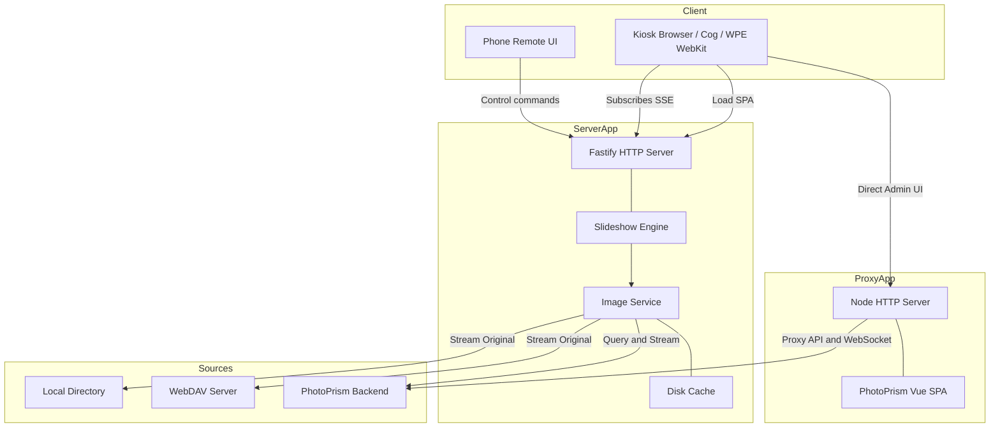

# PicoGallery V2

A browser-first digital photo frame. A small **Fastify** server streams and
resizes photos from a source (local folder, PhotoPrism, or WebDAV) and a static
**SPA** renders a fullscreen, server-driven slideshow with crossfades, an OSD,
night mode, and a phone remote. Designed to run a frame on anything that can open
a URL — including a Raspberry Pi in kiosk mode.



## Packages

| Package        | Role                                                          |
|----------------|---------------------------------------------------------------|
| `@pico/shared` | Zod schemas + types shared by client and server (the contract)|
| `@pico/server` | HTTP API, slideshow engine, image service, photo sources      |
| `@pico/client` | Vite SPA: frame view (`/`) and phone remote (`/remote`)       |

## Quick start (local)

```bash
./run.sh setup            # pnpm install
# point a source at sample_photos (HEIC supported) or your PhotoPrism — see below
PICO_CONFIG=./config.local.toml ./run.sh dev   # server :8188 + Vite :5173
```

Open <http://localhost:5173> for the frame, `/remote` for the phone control.

Minimal config to drive the bundled demo photos:

```toml
[http]
port = 8188

[[sources]]
name      = "directory"
paths     = ["./sample_photos"]
order     = "alphabetical"
```

Config is resolved from `$PICO_CONFIG`, then `~/.config/picogallery/config.toml`,
then `/etc/picogallery/config.toml`. Every key is overridable with
`PICO_<SECTION>_<KEY>` env vars (e.g. `PICO_HTTP_PORT=9000`). See
[`config.example.toml`](config.example.toml) and [docs/sources.md](docs/sources.md).

## Docker

```bash
docker compose -f docker/docker-compose.yml up --build
# frame at http://localhost:8188 from ./sample_photos
```

## Raspberry Pi kiosk (Cog + Cage / WPE WebKit)

The appliance display surface is **Cog (WPE WebKit)** running under the **Cage**
Wayland kiosk compositor — no X11, no desktop. Cage opens DRM/KMS directly via
`seatd` and forces its single client (Cog) fullscreen. This is light enough for a
Pi Zero–class device. Provision a Pi with:

```bash
sudo ./scripts/install.sh http://<server-host>:8188
# also run the server on this Pi:
sudo ./scripts/install.sh --with-server http://localhost:8188
# optional nightly display blank (off 22:00 → on 07:00):
sudo ./scripts/install.sh --blank-on=22:00 --blank-off=07:00 http://<server-host>:8188
```

`install.sh` installs `cog` + `cage` + `seatd`, a dedicated `picokiosk` user, a
systemd unit, and a tight sudoers entry, then boots straight into the frame. It
also installs:

* **launcher** (`/usr/local/bin/picogallery-kiosk`) — waits for the server's
  `/api/v1/health` before opening Cog, so the frame never lands on a "network
  error" page during boot.
* **`pico-display-power`** + `pico-display-{on,off}.timer` (only with
  `--blank-on/--blank-off`) — daily display power via `vcgencmd`, DSI backlight,
  or DRM DPMS.

Source for the launcher/unit/sudoers lives in [`kiosk/cog/`](kiosk/cog/). See
[docs/deployment.md](docs/deployment.md) for details.

### Mimic the kiosk on a dev machine

Cog+Cage are Linux/Wayland-only and can't run on macOS. To preview the frame as
the kiosk would show it, use the host browser:

```bash
./run.sh kiosk            # open the frame in the default browser (or real Cog+Cage on a Pi)
./run.sh appliance        # server + frame kiosk together, end to end
```

## CLI Reference

### `./run.sh` Commands

| Command | Description |
|---|---|
| `./run.sh setup` | Install all workspace dependencies using `pnpm`. |
| `./run.sh dev` | Start development servers (Vite client with HMR on `:5173`, Fastify API on `:8188`). |
| `./run.sh build` | Build all packages (`@pico/shared` → `@pico/server` → `@pico/client`) for production. |
| `./run.sh start [config]` | Build production client assets, then start Fastify server. Explicit config path optional. |
| `./run.sh clean` | Delete all built packages (`dist`) and `node_modules` folders. |
| `./run.sh typecheck` | Run typechecker (`tsc --noEmit`) across the monorepo. |
| `./run.sh kiosk [url]` | Open the frame in the kiosk surface (real Cog+Cage on Linux/Pi; default-browser mimic on macOS). |
| `./run.sh appliance [config]` | Mimic the whole appliance: build, start the server, then open the frame kiosk. |
| `./run.sh photoprism <url>` | Start the PhotoPrism Vue proxy host on `:8190` pointing to the specified backend URL. |

### `scripts/install.sh` (Pi, Cog+Cage) Flags

Run on the device as root: `sudo ./scripts/install.sh [flags] <frame-url>`.

| Flag | Parameter | Description |
|---|---|---|
| `<frame-url>` | `URL` | Positional. The PicoGallery frame to display (default: `http://localhost:8188`). |
| `--with-server` | (None) | Also install a systemd unit for the PicoGallery server from this repo. |
| `--blank-on=` | `HH:MM` | Time to blank the display. Requires `--blank-off`. |
| `--blank-off=` | `HH:MM` | Time to wake the display. Requires `--blank-on`. |

---

## Configuration Reference (`config.toml`)

All keys support both `snake_case` and `camelCase`. Below is the complete configuration matrix:

### `[display]`

| Key | Type | Default | Description |
|---|---|---|---|
| `slide_duration_secs` | `number` | `10` | Seconds to show each photo. |
| `transition` | `string` | `"fade"` | Transition effect: `cut` \| `fade` \| `slide_left` \| `slide_right`. |
| `transition_ms` | `number` | `800` | Duration of the transition animation. |
| `fill_screen` | `boolean` | `false` | If true, crop/zoom image to cover display; if false, letterbox. |
| `letterbox_blur` | `boolean` | `true` | If true, blur the photo in the letterbox background instead of solid black. |
| `ken_burns` | `boolean` | `false` | Enable slow pan/zoom animation. |
| `show_osd` | `boolean` | `true` | Display information overlay (filename, metadata, date). |
| `show_clock` | `boolean` | `false` | Display local clock overlay. |
| `order` | `string` | `"shuffle"` | Sort mode: `shuffle` \| `chronological` \| `newest_first` \| `date_cluster`. |
| `on_this_day_boost` | `boolean` | `true` | Give photos taken on today's calendar date higher priority. |
| `max_image_mb` | `number` | `100` | Maximum source file size before the guard rejects it (`413`). |
| `max_megapixels` | `number` | `64` | Maximum source megapixels before the guard rejects it (`413`). |

### `[display.night]`

Adjusts display parameters when screen blanking is not active.

| Key | Type | Default | Description |
|---|---|---|---|
| `start` | `string` | `none` | Night schedule start time (`HH:MM`). |
| `end` | `string` | `none` | Night schedule end time (`HH:MM`). |
| `dim_percent` | `number` | `none` | Target brightness percentage (e.g. `25` for 25%). |
| `warmth` | `number` | `none` | Temperature warmth factor. |

### `[display.schedule]`

Hardware control schedules (toggled via systemd/cron hooks).

| Key | Type | Default | Description |
|---|---|---|---|
| `on` | `string` | `none` | Turn display on time (`HH:MM`). |
| `off` | `string` | `none` | Turn display off time (`HH:MM`). |

### `[cache]`

| Key | Type | Default | Description |
|---|---|---|---|
| `max_mb` | `number` | `256` | Disk resize cache budget limit. |
| `dir` | `string` | (Temp folder) | Directory to store processed thumbnail cache files. |

### `[http]`

| Key | Type | Default | Description |
|---|---|---|---|
| `host` | `string` | `"0.0.0.0"` | IP binding address. |
| `port` | `number` | `8188` | Local HTTP server port. |
| `auth_token` | `string` | `none` | Guard server `/control` and media paths with a `Bearer` token. |
| `cors_origins`| `array` | `[]` | Allowed cross-origins whitelist. |

### `[device]`

Physical panel commands to toggle display power when scheduled.

| Key | Type | Default | Description |
|---|---|---|---|
| `hdmi_power` | `boolean` | `false` | If true, try to toggle display using system tools. |
| `display_on_cmd` | `string` | `none` | Custom command to run when display turns on. |
| `display_off_cmd`| `string` | `none` | Custom command to run when display turns off. |

---

## Environment Variables Mapping

Any configuration option can be overridden using environment variables by following the pattern: `PICO_<SECTION>_<KEY>` (upper-cased).

| Variable | Target Config Key |
|---|---|
| `PICO_HTTP_PORT` | `http.port` |
| `PICO_HTTP_HOST` | `http.host` |
| `PICO_HTTP_AUTH_TOKEN` | `http.auth_token` |
| `PICO_CACHE_DIR` | `cache.dir` |
| `PICO_CACHE_MAX_MB` | `cache.max_mb` |
| `PICO_DISPLAY_SLIDE_DURATION_SECS` | `display.slide_duration_secs` |
| `PICO_DISPLAY_TRANSITION` | `display.transition` |
| `PICO_DISPLAY_FILL_SCREEN` | `display.fill_screen` |

---

## Sources Configuration

Configure multiple photo libraries simultaneously under the `[[sources]]` table arrays. 

### 1. Directory Source (`name = "directory"`)
* `paths` (array of strings, e.g. `["/photos"]`) - Root folder directories containing images.
* `recursive` (boolean) - If true, crawl subfolders recursively.
* `order` (string: `shuffle` \| `alphabetical` \| `date_modified`).
* `allowed_albums` (array of strings) - Subfolder whitelist filter.
* `rescan_interval_secs` (number).

### 2. PhotoPrism Source (`name = "photoprism"`)
* `url` (string) - HTTP address of your instance.
* `username` & `password` (strings).
* `album` (string) - Point to a specific PhotoPrism collection.
* `favorites` (boolean) - Only load favorite images.
* `quality` (number: `1` to `5`) - Quality score floor filter.
* `country` (string, e.g., `us`, `fr`) - Two-letter ISO country code.
* `year` (number).
* `orientation` (string: `portrait` \| `landscape`).
* `people` (array of strings).
* `labels` (array of strings).
* `include_private` (boolean).
* `include_archived` (boolean).

### 3. WebDAV Source (`name = "webdav"`)
* `url` (string) - Nextcloud, ownCloud, or generic WebDAV endpoints.
* `username` & `password` (strings).
* `token` (string) - Optional bearer token.
* `recursive` (boolean).
* `skip_tls_verify` (boolean).

---

## Development

```bash
./run.sh typecheck    # tsc --noEmit across all packages
./run.sh build        # shared → server → client
pnpm test             # vitest (server)
```

Requires Node ≥ 22.13 and pnpm. HEIC/HEIF photos are decoded via `heic-convert` because sharp's prebuilt libvips ships without an HEIC decoder.

## Docs

- [docs/architecture.md](docs/architecture.md) — how the pieces fit
- [docs/api.md](docs/api.md) — HTTP + SSE contract
- [docs/sources.md](docs/sources.md) — directory / PhotoPrism / WebDAV
- [docs/deployment.md](docs/deployment.md) — local, Docker, Pi kiosk, env vars
