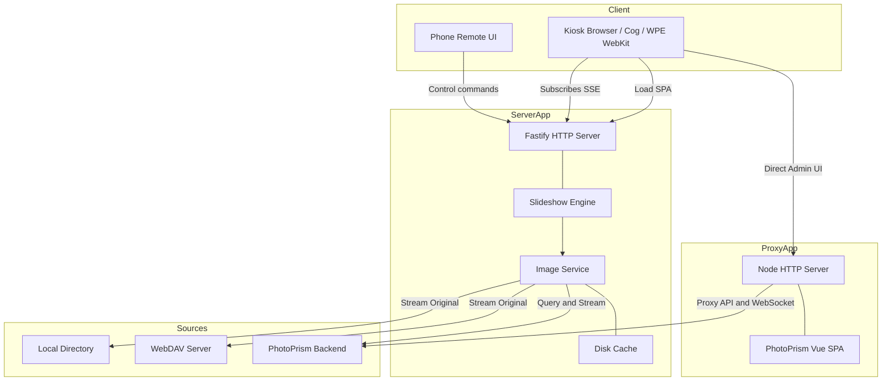

# Architecture

PicoGallery V2 is a three-package pnpm monorepo. The **server** owns all state;
the **client** is a thin renderer driven by Server-Sent Events.

## Dependency graph

```
@pico/shared  ──▶  @pico/server
      └────────▶  @pico/client
```

`@pico/shared` holds Zod schemas and the types inferred from them — the single
source of truth for the API contract. Both other packages import it; nothing in
shared imports back.

## System Architecture Flow



## Server (`@pico/server`)

```
http/        Fastify app, routes, SSE, error envelope
engine/      playlist + cursor + scheduler + event bus (pure, testable)
images/      sharp resize, content-hash disk cache, guards, HEIC fallback
sources/     photoprism | webdav behind one PhotoSource interface
config/      TOML + env loader, Zod-validated RootConfig
telemetry/   pino logger
```

- **Engine** is server-authoritative: it builds an ordered playlist, advances a
  cursor on a timer, applies ordering modes (`shuffle`, `chronological`,
  `newest_first`, `date_cluster`) plus an optional on-this-day boost, and
  broadcasts `state` over an event bus. Control actions mutate the engine and
  re-broadcast, so every connected frame stays in lockstep.
- **Image service** fetches an original from the source, transcodes HEIC to JPEG
  when needed, resizes with sharp, and caches the result on disk keyed by a
  content hash + dimensions + format. Cache hits return immutable bytes with an
  `ETag`; `If-None-Match` yields `304`.
- **Sources** all implement `PhotoSource` (`list`, `getOriginal`, `authStatus`,
  `setFavorite`, …), so adding a backend never touches the engine or HTTP layer.

`server/src/index.ts` boots the HTTP server immediately (so `/health` and the
Vite proxy work right away), then loads sources and starts the engine in the
background. `/ready` returns `503` until the playlist is non-empty.

## Client (`@pico/client`)

```
slideshow/   stage, transitions (crossfade), preload/decode, ken burns
overlay/     OSD pill, clock, night filter, disconnect badge
control/     phone remote
api/         REST client + SSE EventSource wrapper
styles/      tokens + frame + remote CSS
```

The frame opens an `EventSource` on `/events`, requests the current
photo at display dimensions, `decode()`s the next image before swapping (no
flash), and re-requests on window resize. The remote posts to `/control` and
reflects live status from the same SSE stream.

## Configuration

`config/loader.ts` resolves a TOML file (`$PICO_CONFIG` → user → system), applies
`PICO_*` env overrides, normalizes `snake_case` display keys to `camelCase`, and
validates the whole thing with `RootConfigSchema`. Invalid config fails fast with
a readable message — there is no partial/best-effort startup.
